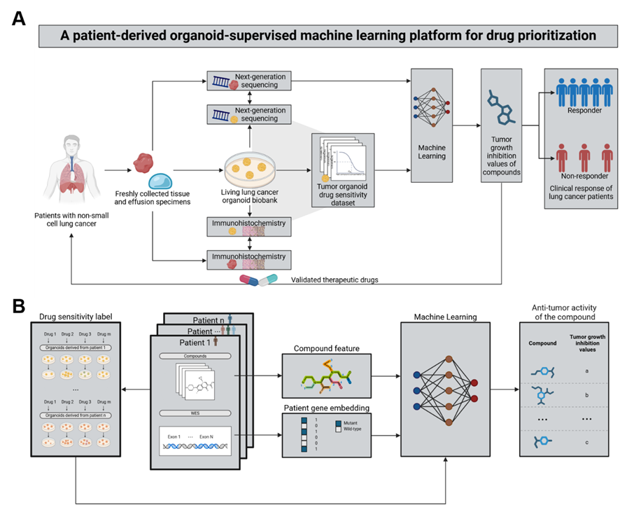

<div align="center">

# PDO-Supervised Multimodal Framework for Personalized Drug Response Prediction (TSME)

[](https://www.python.org/downloads/)
[](https://pytorch.org/)
[](https://www.rdkit.org/)
[](https://opensource.org/licenses/MIT)

</div>

## 📖 Overview

This repository provides an end-to-end precision medicine prediction framework that integrates **patient-derived organoid (PDO) pharmacology**, **tumor genomics**, and **multimodal machine learning**. 

By utilizing experimentally measured PDO drug responses (e.g., tumor growth inhibition values) as functional supervision signals, the model integrates compound structural representations with patient-specific mutational features. This multimodal approach enables accurate evaluation and prioritization of individualized therapeutic regimens for lung cancer patients.

<div align="center">
  
  <p><em>Overview of the TSME multimodal framework for personalized drug response prediction.</em></p>
</div>

---

## 📂 Repository Structure

The directory structure of the repository is organized as follows:

```text
├── 2026_04_ds/                     # Datasets and cross-validation splits
│   ├── dataset_01_w_24_compounds   # Base dataset for 24 compounds
│   ├── fold0/                      # 5-fold cross-validation - Fold 0
│   ├── fold1/                      # 5-fold cross-validation - Fold 1
│   ├── fold2/                      # 5-fold cross-validation - Fold 2
│   ├── fold3/                      # 5-fold cross-validation - Fold 3
│   ├── fold4/                      # 5-fold cross-validation - Fold 4
│   ├── time_test/                  # Independent temporal test set
│   ├── drugcell_ont.txt            # Cell network ontology file
│   └── gene2ind.txt                # Gene-to-Index mapping file
│
├── config/                         # Configuration directory
│   └── exp.yml                     # Core experiment configuration parameters
│
├── hubdata/                        # Model outputs and intermediate data
│   └── model/                      # Saved model weights and checkpoints
│
├── README.md                       # Project documentation
├── requirements.txt                # Environment dependencies
└── run_train.py                    # Main script for training and evaluation

```

# 🛠️ Environment Setup
It is highly recommended to use Conda to create an isolated virtual environment to avoid dependency conflicts:

# Bash
Create and activate the virtual environment
```text
conda create -n tsme_env python=3.10 -y
conda activate tsme_env
```

# Install core dependencies (including PyTorch, RDKit, XGBoost, scikit-learn, etc.)
```text
pip install -r requirements.txt
```
# 🚀 How to Run
This framework features a fully automated pipeline. All network architecture parameters, dataset paths, and cross-validation settings are pre-configured in config/exp.yml. No manual hyperparameter tuning is required.

To initiate the complete training, multi-fold cross-validation, and test set evaluation process, simply run the following command in the root directory:
```text
python run_train.py
```

💡 Execution Details:
The script automatically parses config/exp.yml and loads the gene mutation indices (gene2ind.txt) and cell network ontology (drugcell_ont.txt) from the 2026_04_ds/ directory to construct multimodal embeddings.

Cross-validation metrics and final model weights generated during training will be automatically saved to the hubdata/model/ directory.

# 📊 Citation
Paper Status: Under review.

Once published, the formal citation information will be updated here. If you find this framework useful for your research, please refer back to this repository for future updates.
